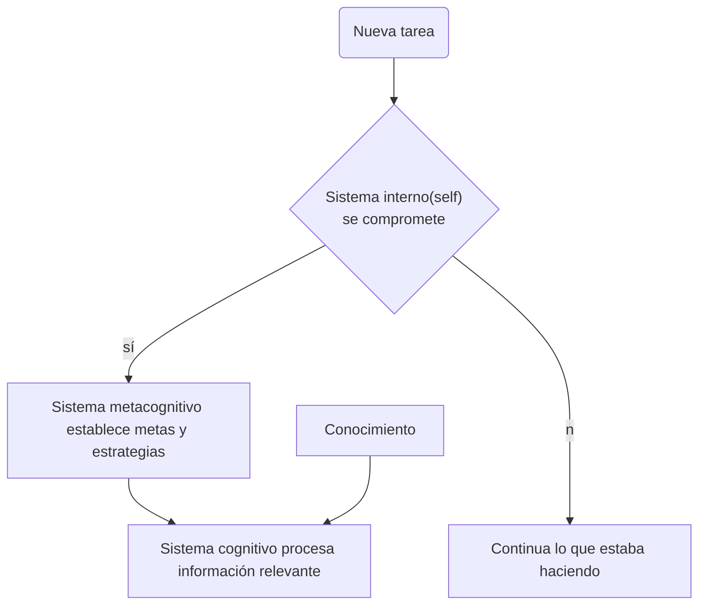

# Manual: La Nueva Taxonomía de Marzano y Kendall: una alternativa para enriquecer el trabajo educativo desde su planeación.'
Katherina Edith Gallardo Córdova (2009) [enlace](http://www.cca.org.mx/profesores/congreso_recursos/descargas/kathy_marzano.pdf)

En contraste con la [[taxonomía de Bloom]]

>Abstract: La Nueva Taxonomía parte de diferentes estudios sobre los procesos de pensamiento y dominios del conocimiento. Dicha Taxonomía constituye una alternativa actual para identificar mejor dónde estamos y hacia dónde queremos llegar en el proceso de enseñanza-aprendizaje en las diferentes disciplinas. Esperamos que los docentes encuentren esta guía útil y práctica para fines de mejoramiento de su quehacer formativo.

## Modelo de conducta ante el aprendizaje

>Basado en Marzano y Kendall 2007

