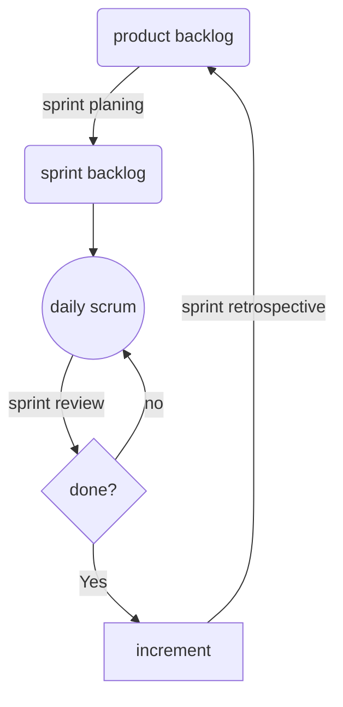

# The professional product owner: leveraging Scrum as a competitive advantag
Don McGreal, Ralph Jocham (2018)

Refuerza la visión en los *sprint plannings* y en los *sprint reviews*; para cuestionarla usa los *sprints retrospective* [[gestion-agil]]

## Producto

>A product is anything that can be offered to a market that might satisfy a want or need. (Capítulo 1: Agile Product Management)

## Visión

La visión se comunica a través de un *vision statement* (declaración de visión)

### Técnicas para crear visión

Están en el capítulo 2

#### Técnica de la caja

Imagina una caja que anuncia el producto y describe sus componentes:

- Nombre de producto
- Imagen
- Cliente objetivo obvio
- Propuesta de valor obvia para ese cliente objetivo

#### Elevator pitch

Es una forma muy breve y concisa de comunicar elv alor y la visión del producto. El libro ofrece una plantilla sacada del libro *Crossing the Chasm* de Geoffrey Moore:

>For … *(target audience)*
>who … *(need, want)*
>*(product name)* is a … *(market category)*
>that ... *(one key benefit)*
>unlike … *(competition or current situation)*
>our product *(competitive advantage)*

#### Matriz práctico / emocional

Evalúa tu propuesta de valor en una matriz de dos dimensiones: lo emocional (eje y) y lo práctico (eje x) mejórala hasta que cumpla con suficientes 

## Valor

El valor resuelve problemas, mejora procesos o trabajos actuales, reduce costos, aumenta ventas, en fin, es todo lo que tiene un impacto positivo en el cliente o la empresa. El valor tiende a medirse a través de métricas especiales.

Algunas métricas internas de valor son: frecuencia de lanzamiento de software (nuevas características o nuevos productos), fortalecimiento del software (refactorización, mejoras).

El valor puede ser negativo.

## Validación

La validación de proceso mide qué tan bien el equipo trabaja.

La validación de producto mide qué tan adecuado es lo que se está construyendo. Debe hacerse lo más pronto posible, para eso debe ser corta, transparente y evaluable. Esto se logra a través de MVP (*minimum viable products*) que pueden ser diversos, desde prototipos de alta fidelidad hasta folletos que venden productos aún inexistentes.

Se debe decidir pronto si un producto permanecerá o deberá cambiar (*pivot*).

## Scrum

### Flujo

### Artefactos de scrum

Sólo hay tres, **son mandatorios**: el *product backlog*, el *sprint backlog* y el *increment* (o valor entregado en forma de *release*).

### Gestión del backlog

El backlog contiene: *user stories*, *bugs*, *experimentos*. Cada uno en diferentes grados de definición, *se van definiendo en los sprint reviews* de acuerdo con su prioridad. Cada uno requiere que en su definición *estén claros y documentados para todos los criterios de aceptación*. 

#### Responsabilidad de último momento

>A strategy of not making a premature decision but instead delaying commitment and keeping important and irreversible decisions open until the cost of not making a decision becomes greater than the cost of making a decision.

## Sacar a producción

La frecuencia de entregas a producción es posiblemente la métrica más importante. Es posible usar una metodología ágil sin sacar nada a producción en seis meses. *Esto es un indicador de que tenemos una mentalidad de proyecto y no de producto*.

Este es el orden de importancia que tiene un lanzamiento, de mayor a menor valor:

1. Petición de cliente
2. Oportunidad de mercado
3. Despliegue requerido (por cuestiones legales o requerimientos administrativos)
4. Compromisos de una funcionalidad específica para un prospecto, socio o cliente
5. Respuesta a competencia para mantener la relevancia
6. Lanzamiento mayor para cumplir con actualizaciones o compromisos
7. Mantenimiento o deuda técnica

### El problema de los múltiples proyectos en los equipos

>Organizations often try to get more out of their Development Teams by throwing multiple projects at them, resulting in the problem described by Johanna Rothman in Manage Your Project Portfolio.

>Figure 8-5 shows that the number of active projects increases the competition for people’s time. This reduces the ability to finish projects quickly, which lowers the number of completed projects. But all the projects are planned for the whole fiscal year, and you now need to start other projects. That is usually the moment when working on multiple simultaneous projects seems to make a lot of sense. In this complex adaptive system, this is called a positive reinforcement loop. This loop feeds on itself and worsens the situation with every revolution. Eventually you are so busy and so overloaded and doing so many things in parallel that nothing can be shipped.

==Hay que calcular la capacidad del equipo para completar proyectos.==

>==The solution here is to stop thinking about long projects and start thinking instead about shipping value through products.==

>I have found that the only situation in which having one Development Team work on many products makes sense is with small companies that support multiple products but have budget for only one team. One Product Owner I worked with placed all the work across the products into one Product Backlog and had to determine which products took precedence each Sprint. It certainly wasn’t as effective as having dedicated Development Teams for each product, but it was a price the company was willing to pay given its situation.
><cite>─ Don McGreal</cite>

### Escalar productos

**El portafolio debería tener un backlog que se corresponda con el backlog de productos en desarrollo.**

Assignar más productos a un mismo equipo de desarrollo lleva a un ciclo negativo de no completar proyectos. También añadir más gente o crear más equipos con la finalidad de incrementar la velocidad o escalar el portafolio.

Calcular el porcentaje de avance de un proyecto ágil con la simulación de Monte Carlo
