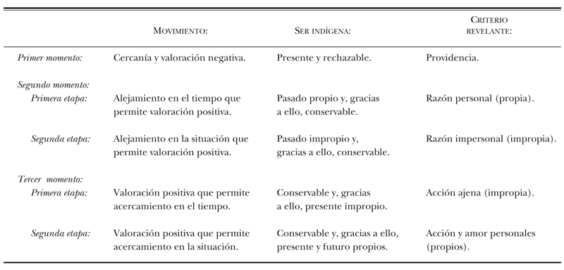

# Los grandes momentos del indigenismo en México

Luis Villoro 2022, [zotero](zotero://select/items/@villoro2022)

## Notas

## Lectura inspeccional

<!--Según el título, prefacio, epígrafe, solapa, de qué trata el libro-->Este libro es un estudio sobre el [[indigenismo]] en México a lo largo de su historia, desde la conquista de Mesoamérica hasta la fecha de su publicación (1950, primera edición). El estudio tiene una perspectiva filosófica que se puede ver en el primer párrafo de la introducción:

 >
 > Este libro trata de responder a una pregunta: ¿cuál es el ser del indio que se manifiesta a la conciencia mexicana? Con lo que no interrogamos por lo que el indio sea en sí mismo, sino por lo que en el indio revelan aquellos que de él se ocupan. [@villoro2018, 9]

Desde el primer momento, el tratamiento filosófico abstrae el estudio a un fenómeno relacional. Parte del vínculo entre dos clases de sujetos: el indio y aquellos que de él se ocupan. Pero el énfasis no está en éste ni aquellos, sino en las representaciones y valoraciones que nacen de esta relación, donde el indio es «lo mirado» y los que se ocupan de él, «lo que mira». Esta distinción es fundamental porque establece varios principios interpretativos:

* El indio *no es* lo que dicen aquellos que se ocupan de él
* Lo que dicen del *indio* aquellos que se ocupan de él es el «ser manifestado» en la conciencia mexicana, hoy diríamos, una representación, que a su vez implica una valoración (moral, estética, cultural, etcétera)
* Esta representación es producto de una relación donde unos tienen más poder, o agencia, para representar y valorar. Por tanto, la mirada del indio queda fuera del estudio del indigenismo

<!--Según la tabla de contenido, índices, apéndices. Cómo se estructura-->La estructura del libro refleja también el método usado. El texto se ordena a partir de los tres «grandes momentos», que son partes donde el autor explora estas representaciones y valoraciones a partir de los casos de personajes históricamente relevantes para cada uno. En consecuencia, tenemos un concepto abstracto, generalizado, el de «indigenismo», que va tomando formas concretas según cambia la «conciencia histórica», lo cual implica modificaciones en su contenido, aunque en la forma se mantenga igual.

<!--Un párrafo por momento-->

El primer momento, llamado «Lo indígena manifestado por la providencia», lo constituye la mirada europea durante el proceso de conquista y colonización. Esta mirada se construye con los casos de Hernán Cortés y Fray Bernardino de Sahagún. La de Cortés es una actitud de descubrimiento, un *pathos* de compararlo todo con las cosas de su tierra y un *ethos* de apropiación cristianizadora (que el filósofo llama ecuménica). Por su parte, Bernardino de Sahagún comienza con un horror que satanizó la religión mesoamericana, y le infundió un sesgo metafísico, sobrenatural, a su entendimiento de la conquista. Consideró a los indígenas hermanos de los españoles, reconociendo las que, para él, eran sus fortalezas y virtudes (disciplina, educación, retórica). Cuando describe la religión de forma sobrenatural, la condena, cuando describe la cultura en términos naturalistas, donde la religión era una parte vital, la alaba. De igual forma, la primera parte de su historia insiste en el objetivo práctico de destruir la religión indígena, mientras que la segunda promueve la vuelta a las instituciones aborígenes, más efectivas en la disciplina y transmisión de la virtud. Sahagún comienza el proceso de asimilación, cuya forma, según su obra, busca sustituir unos rasgos culturales por los europeos, e intentar conservar otros considerados deseables.

El segundo momento se da en el contexto de la independencia, «Lo indígena manifestado por la razón universal», el «viejo mundo» somete al «nuevo mundo» a un segundo juicio, ya no sobrenatural, sino usando su nueva herramienta para pesarlo todo: la razón universal, «instrumento occidental de dominio». Es curioso que, aunque Villoro no lo menciona, la etimología de la palabra *católico(a)* significa *universal*. Podríamos decir que, hasta este punto, en ambos momentos del indigenismo, hay en el no-indígena un *ethos* autoritario de abarcarlo, corregirlo y moldearlo todo ya sea con la  religión universal (católica), o con la razón universal. A favor de esta idea, los juicios parecen hacerse análogamente, el Diablo en lo sobrenatural se corresponde con el *desvío de la razón* en el juicio europeo [@villoro2018, 118-120]

Los autores que Villoro explora para este segundo momento son Francisco Javier Clavijero, Fray Servando Teresa de Mier, y Manuel Orozco y Berra. El primero, ante este juicio racionalista de Europa, escribe una defensa en los mismos términos, es decir, naturalista y argumentativa. Argumenta a favor de la diferencia, mas no inferioridad, de los indígenas y la historia natural mesoamericana. El criollo reconoce la herencia europea pero afirma su diferencia, no inferioridad, como americano. Y para poder diferenciarse, el criollo necesita la historia indígena [@villoro2018, 128]. Teresa de Mier, por su parte, defiende a lo indígena creando un relato donde afirma que la religión mesoamericana siempre fue católica, incluso antes de la conquista. Necesita, de acuerdo con Villoro, refutar la idea europea de que América le debe vasallaje por haberle llevado «la luz» (religión o razón *verdaderas*). Manuel Orozco y Berra escribe también una historia natural con un enfoque más bien deductivo. Trata de aplicar «leyes universales» a los hechos concretos de América, de este modo lo despersonaliza y lo reduce a una concepción mecánica de la historia: «Será el indio una muestra más de un pueblo antiguo semicivilizado, con todos los caracteres típicos de cualquiera de éstos» [@villoro2018, 151].

El tercer momento, «Lo indígena manifestado por la acción y el amor» es precedido por autores como Francisco Pimentel, quien ve en los indígenas un Otro separado, casi enemigo, que es necesario intervenir para convertir a México en una nación. Andrés Molina Enríquez, Bulnes o Pimentel ven al indígena como un grupo homogéneo, totalmente separado y alejado del mexicano criollo y mestizo, pero sin perder la condición de servidumbre que tenía en la colonia: «el indígena aparece como colectividad explotada que a veces lucha por su emancipación, pero las más incuba su rencor, esperando su hora» [@villoro2018, 170], y con esta afirmación se va transitando de la noción de *raza* a la de *clase*. Aunque, para convertirla en una clase en sentido marxista, faltarán los esfuerzos del indigenismo revolucionario. Cada grupo lo usa a conveniencia, si necesita de fuerza de trabajo o de simpatías por la causa, los criollos contra europa, la incipiente burguesía liberal amestizada contra el terrateniente criollo. El mestizo se vuelve el sujeto histórico de México, y el indio se vuelve el Otro por cuyo contraste el mestizo puede autodefinirse [@villoro2018, 180].

Este tercer momento se consolida con la institucionalización del indigenismo, de la mano de Manuel Gamio (entre otros como Alfonso Caso), quien buscó, según Villoro, la forma más adecuada de combinar la cultura occidental con la nativa. Conservar íntegramente lo más valioso, el arte indígena, y cambiar, mediante un diálogo antropológico, los aspectos tecnológicos y científicos. Esto es, asimilar al indígena de forma paulatina, no violenta [@villoro2018, 195], en contraste con otras posicinoes que quieren occidentalizarlo de súbito. En el fondo, Villoro denuncia lo que está detrás de los proyectos de este periodo, la liberación o el sujuzgamiento del indio: «El indianista fanático trata al indio como hombre libre, pero, en el fondo, quiere que permanezca esclavo. El occidentalista exaltado quiere al indio libre, pero, de hecho, lo trata como esclavo» [@villoro2018, 197].

El indigenismo es al principio una teoría orientada a la práctica, y la acción tiene como fin cerrar la brecha que separa lo indígena de lo mestizo occidentalizado: «El tipo de mentalidad del mestizo, que recibiera de occi­dente, lo separa del indio; pero su interés económico, su afán de  liberación y de lucha lo acercan a él» [@villoro2018,206], porque sin eso, no habría una unificación nacional, fin último de todos los esfuerzos. Pero Villoro ve también el efecto del «amor» en el proyecto indigenista, ya que sin él, sería fácil caer en la violencia etnocida contra el indígena. Ambas cosas, acción y amor, se convierten en pasión, sentimiento que describe para el autor el núcleo del tercer momento indigenista de México.

<!--Los conceptos principales sus relaciones y argumentos según el escaneo de páginas-->

Finalmente, en las conclusiones el autor ofrece una síntesis de los momentos, dentro de los cuales hay varias etapas que van orientando las ideas y las acciones hacia determinada dirección, más cerca o más lejos de lo indígena. Villoro considera que hay una dialéctica de los momentos donde se establecen tesis, antítesis y finalmente, una síntesis orientada a la superación.

* Tesis durante el primer momento: el indio aparece como cercano y negativo (con rasgos demoniacos)
* Antítesis, durante el segundo momento: el indio aparece como lejano y positivo (objetivado por Orozco, valorado positivamente)
* Síntesis durante el tercer momento: el indio busca aparecer como cercano y positivo. Se trata de acercar de nuevo al indio, pero no a la manera del primer momento, sino en la búsqueda de una superación

Su argumento general queda sistematizado en un cuadro explicativo. En esta tabla es posible ver la dinámica histórica de las ideas y prácticas indigenistas a lo largo de la historia, hasta donde Villoro las analiza.

<!--Críticas y valoraciones: El libro me gustó / no me gustó porque-->

Villoro abogó finalmente por la autonomía y la necesidad de un Estado pluricultural. Cincuenta y cuatro años después de la primera edición de la obra que resumo, en una entrevista publicada por el Instituto de Investigaciones Filosóficas de la UNAM, su entrevistador le hace una pregunta que, en su propio planteamiento, revela el estancamiento general de la mirada indigenista en el imaginario nacional:

 >
 > Entrevistador: ¿Los problemas del indigenismo se han modificado?, 'se ha modificado el estatus de las comunidades indígenas en los últimos cincuenta años? o en los últimos quinientos años, o ¿se han mantenido sin evolución? ¿Es el mundo del indígena mexicano un mundo que se ha mantenido en una especie de esfera al margen del progreso nacional? ¿Al margen del desarrollos ocial nacional? ¿O ha habido progreso en el sentido de incorporación o en el reconocimiento de sus autonomías? [vale la pena ver la expresión facial del filósofo al escuchar estos planteamientos]
 >
 > Villoro: Muy buena pregunta. Yo creo que sólo puede contestarse en el sentido que han manifestado los propios indígenas. Las comunidades indígenas tienen como problema fundamental el no reconocimiento por parte del Estado. El Estado nuestro es un Estado que no reconoce, fundamentalmente, la identidad de los indígenas, y esto da como consecuencia una rebeldía. El problema de los indígenas no puede entenderse más que como un problema de rebeldía frente al Estado mexicano[^villoro2018-1].

[^villoro2018-1]: Instituto de Investigaciones Filosóficas-UNAM. 2004. *Entrevista al Dr. Luis Villoro (2004)*, min. 16:18 en adelante. Recuperado de <https://www.youtube.com/watch?v=L_54JA2BhUY> el 10 de mayo del 2024.

## Extractos
