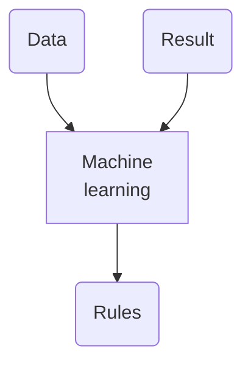

# aprendizaje de máquinas supervisado
Un tipo de [[aprendizaje de máquinas]] donde se dan los datos de entrada y el resultado, generalmente creado por humanos, para obtener las reglas:

```mermaid
graph TD
A(Data) --> C[Machine<br/>learning]
B(Result) --> C
C --> E(Rules)
```
