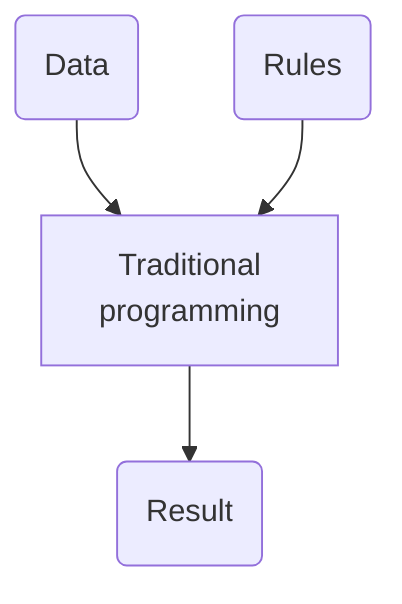
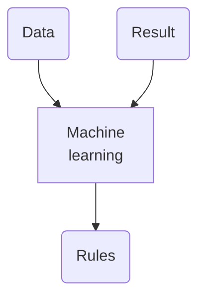

# aprendizaje de máquinas
Un subconjunto de la [[inteligencia artificial]] basado en el entrenamiento de agentes artificiales de información a través de algoritmos.

Según el [curso de Google](https://youtu.be/_oF7z-6QU4o?si=ycZSWo4H-Jl1GlNq) sobre aprendizaje de máquinas En programación tradicional hay datos que se procesan con reglas escritas para producir un resultado predecible. 

El aprendizaje automático en cambio recibe datos y resultados para predecir las reglas:

Este último modelo corresponde al *aprendizaje supervisado*, ya que los resultados forman parte del entrenamiento, y son generalmente dados por humanos. Así, tenemos:

- [[aprendizaje de máquinas supervisado]]
- [[aprendizaje de máquinas no supervisado]]
- [[aprendizaje de máquinas reforzado]]
- [[aprendizaje profundo]]

Relacionado (elaborar):

- [[ciclo de vida de un modelo de IA generativa]]
