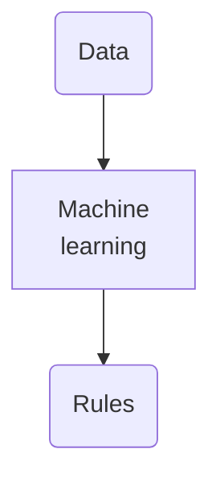

# aprendizaje de máquinas no supervisado
Un tipo de [[aprendizaje-de-maquinas]] que un modelo donde se dan los datos de entrada, pero no el resultado

```mermaid
graph TD
A(Data) --> C[Machine<br/>learning]
C --> E(Rules)
```
