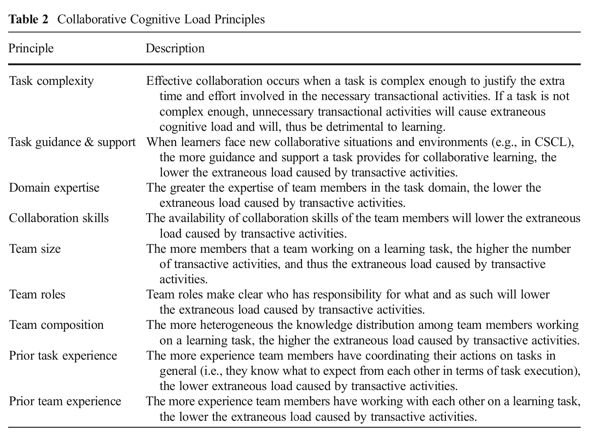

# carga cognitiva colaborativa

Es un tipo de [carga-cognitiva](carga-cognitiva.md) que extiende el modelo para aplicarlo a grupos de aprendizaje o colaboración, que funcionan en este contexto como un sistema. La información disponible incrementa porque los conocimientos de todos están disponibles para el grupo. De este modo, es posible distribuir la carga cognitiva entre varias personas.

La colaboración debe considerar niveles desiguales de conocimiento entre los miembros de grupo; si estos niveles no son considerados, estos colaboradores experimentan [carga-cognitiva-ajena](carga-cognitiva-ajena.md) debido a «[actividades-transactivas](actividades-transactivas.md) no relacionadas con la tarea» [@kirschner&al2018, 222].

El fundamento de esta extensión puede ser la psicología evolutiva [@kirschner&al2018](@kirschner&al2018.md), según la cual, la humanidad es una de las pocas especies capaces de aprender de otros, ya que ha evolucionado para colaborar. Se trata de una característica biológica primaria (cfr. [leer-y-escribir-no-es-natural](leer-y-escribir-no-es-natural.md)).

