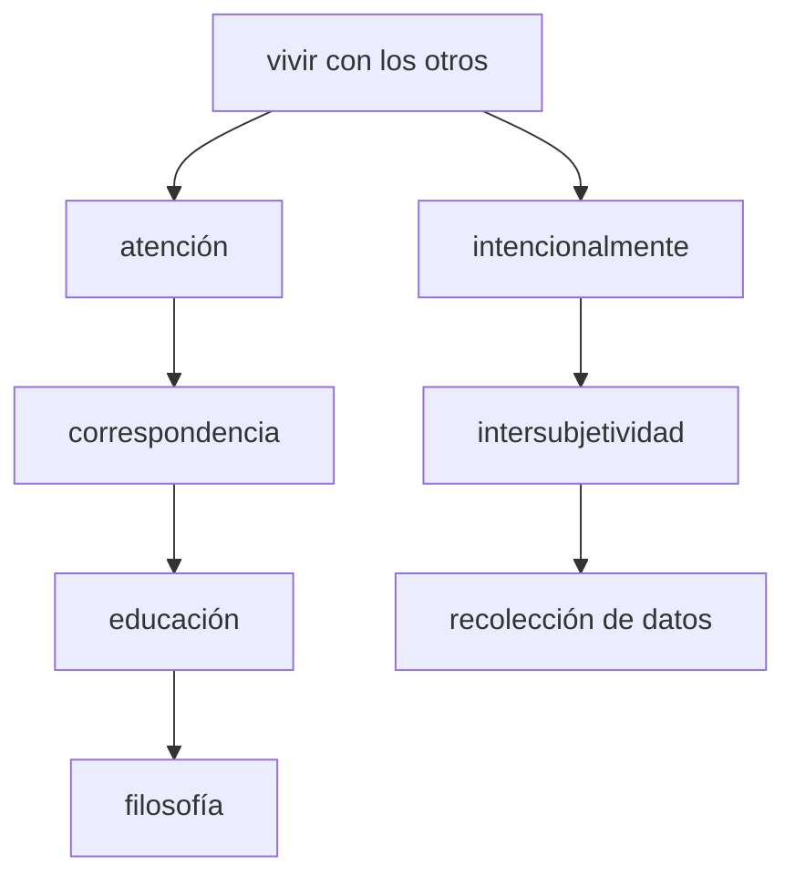

# diferencias entre participar y observar
La diferencia más clara entre participar y observar en un proceso de investigación (usando [[observación participante]] es que participar involucra la inmersión en el campo, mientras que observar implica cierto distanciamiento. A partir de esta distinción básica es posible elaborar criterios más ricos del [[estar ahí]] en el [[trabajo de campo]].

 Tim Ingold no está de acuerdo con esta diferencia, pues para él:

>Tal como todos somos conscientes, este conocimiento no consiste en proposiciones sobre el mundo sino en las habilidades de percepción y en las capacidades de juicio que se desarrollan en el curso del involucramiento directo, práctico y sensual con los entornos que nos rodean. Esto es para refutar, de una vez por todas, la falacia común de que la observación es una práctica dedicada exclusivamente a la objetivación de los seres y las cosas que acaparan nuestra atención y su remoción de la esfera de nuestro involucramiento sensible con los consocios. [@ingold2017, p. 149]

El autor parte de una distinción epistemoĺógica: la observación participante es *vivir con otros y vivir con otros prestando atención*, lo que es opuesto a la actitud de *extraer información del campo para producir proposiciones cargadas de [[autoridad epistémica]]*.

Cuando Ingold habla de poner a la antropología de frente [@ingold2017, p. 156] da más importante al aprendizaje con [[correspondencia]] que a la escritura. Escribe también: *«Si el objetivo último de la antropología no es documental sino transformacional, no sería apropiado entregar un futuro idéntico a como lo hemos recibido del pasado.»* [@ingold2013, p. 13]
