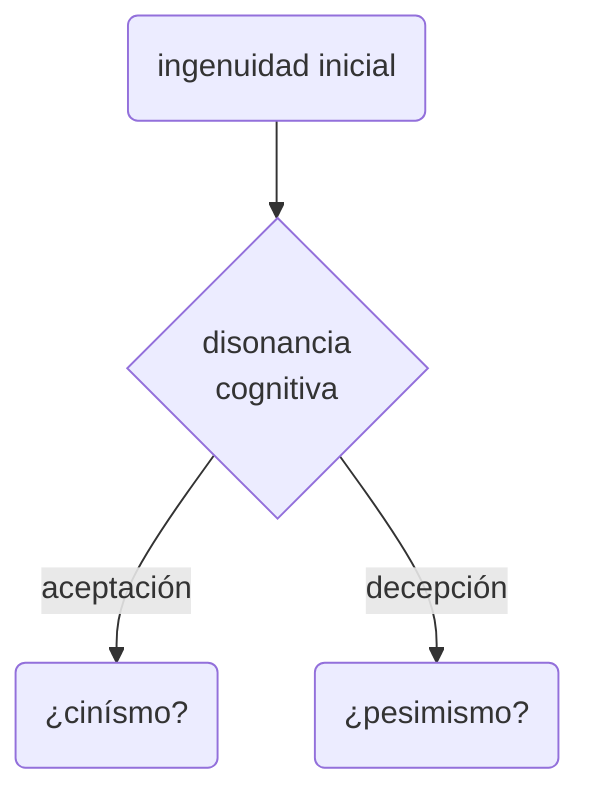

# disonancias cognitivas de la mentira en la práctica profesional de la publicidad
#esquema #idea 

Inspirado en mi experiencia de trabajo con clientes de la industria y la teoría de [[@graeber2020]].

## Descripción de la disonancia cognitiva

Esquema inicial del proceso:

## Cómo es que algunas personas la aceptan y la integran

