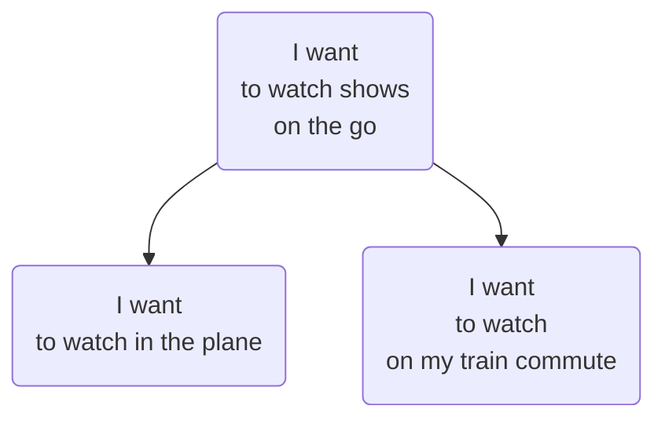

# espacio de oportunidad
Rango de deseos y necesidades que una solución puede cumplir en el proceso de [[descubrimiento-continuo-de-producto]]. Puede considerarse toda el área de oportunidades que aparece en el [[arbol-de-oportunidad-solucion]].

Para esto se puede usar un [[mapa-de-experiencia]] validado con [[entrevista-a-cliente]]. El mapa ordena las diferentes historias (narrativas) de los usuarios.

Es trabajo del *Product Manager* identificar las más importantes (por impacto) y ordenarlas semánticamente en ramas del árbol, para eso puede usar:

- Un proceso de clusterización o agrupamiento de oportunidades similares 
- Un proceso inductivo de [[categorizacion]] basado en los términos del usuario ([[emic]])

La estructura debe ser inductiva, de ser posible, dos oportunidades muy similares deberían tener una oportunidad padre más abstracta:, como en el ejemplo sobre oportunidades de Netflix [@torres2021, 90]\:

