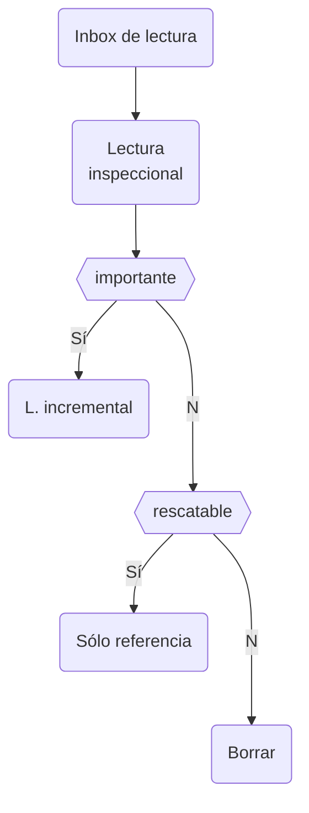

# inbox de lectura
Un [[inbox]] para revisar los artículos, libros y referencias digitales y analógicas que  deberían estar en una sola carpeta `inbox-lectura`. Esa carpeta debería procesarse como parte de este flujo: 

Proceso:

- Mi inbox de textos será una carpeta respaldada en ~/Drive/inbox-lecturas/ 
    - Por default todo texto (principalmente leo textos) o referencia al texto (en formato .bib) que sea mínimamente interesante debería caer en ese directorio
    - Opcionalmente, creo que sería útil renombrar los archivos con su "citekey" más probable, ej. @ahrens2017
    - Los textos podrían estar priorizados de mayor a menor interés. Para eso podría usar el hack de [priorización de todo.txt](https://github.com/todotxt/todo.txt#priority) sustituyendo la @ por (a-z), ej. (A)ahrens2017, de modo que la letra (que va de A-Z) permita a la computadora ordenar por nombre los textos más relevantes
- Cada texto debería recibir una [[lectura inspeccional]] de evaluación para decidir si es importante o no (este método implica decisiones, ver [[inboxes según Matuschak]])
    - Idealmente cada revisión debe terminar en una decisión: se va a lectura incremental, sólo a referencia o se borra
