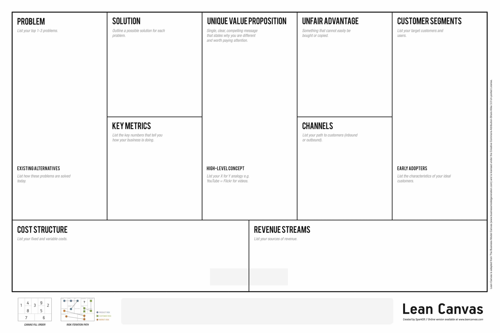

# lienzo startup

Se usa para estructurar el modelo de un producto de manera general, cuando es necesario establecer la perspectiva más amplia del impacto de un producto en el mercado.

Una versión muy usada está en [Business Model Toolbox](https://bmtoolbox.net/tools/lean-canvas/):

