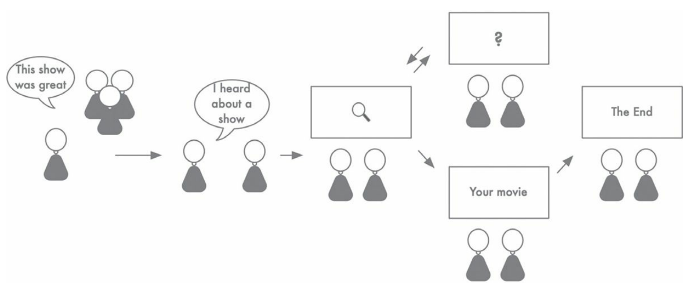

# mapa de experiencia
Una [[tecnica-de-descubrimiento-de-producto]] en el [[espacio-de-oportunidad]].

Consiste en visualizar únicamente la experiencia del usuario, sin tomar en cuenta al producto. Necesita un contexto más profundo de las diferentes situaciones.

Es una especie de cómic, porque cuenta una historia. Pero [[@torres2021]] [p. 56] sugiere que *debe ser visual*, y evitar las palabras.

La dinámica sugerida por [[@torres2021]] es que:

1. Cada miembro del [[triada-de-producto]] crea un mapa individualmente
2. Luego lo comparte con los otros y conversan sobre él, *sin tratar de imponer ninguna versión*
3. Finalmente, llegan a un solo mapa en común con la información de cada uno
