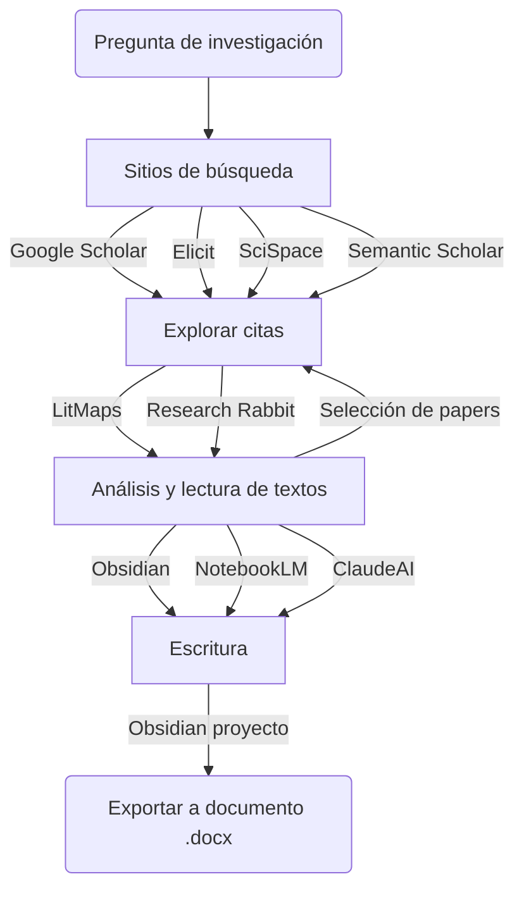

# mi proceso de revisión de literatura
Ver [[nota permanente]]

```mermaid
graph TD
    A(Pregunta de investigación) --> B[Sitios de búsqueda]
    B --> |Google Scholar| C[Explorar citas]
    B --> |Elicit| C
    B --> |SciSpace| C
    B --> |Semantic Scholar| C
    C --> |LitMaps| D[Análisis y lectura de textos]
    D --> |Selección de papers| C
    C --> |Research Rabbit| D
    D --> |Obsidian| E[Escritura]
    D --> |NotebookLM| E
    D --> |ClaudeAI| E
    E --> |"Obsidian proyecto"| F(Exportar a documento .docx)
```
