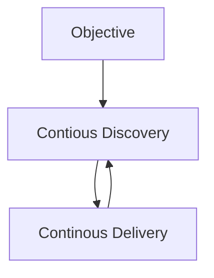

# modelo operativo de producto
Una propuesta de desarrollo de productos elaborada por el [svpg](https://www.svpg.com/) ([[@cagan2017]]) y centrada en estructurar organizaciones productivas según tres componentes clave, objetivo, [[descubrimiento continuo de producto]] y entrega continua.

*Resultados versus entregables*. El objetivo es entregar resultados valiosos (que cumplan el *[[product-market fit]]*), *usables* (en interfaz como en experiencia de usuario), *viable* y viables tanto técnica como legal, comercial o éticamente.

¿Cómo cambiar de un modelo basado en la entrega de funcionalidades a uno basado en la entrega de resultados?

*Transformation techniques*

- Usar el proceso de [[design sprint]] para promover dinámicas más ágiles en el equipo
- [[equipo piloto]] para cambios
