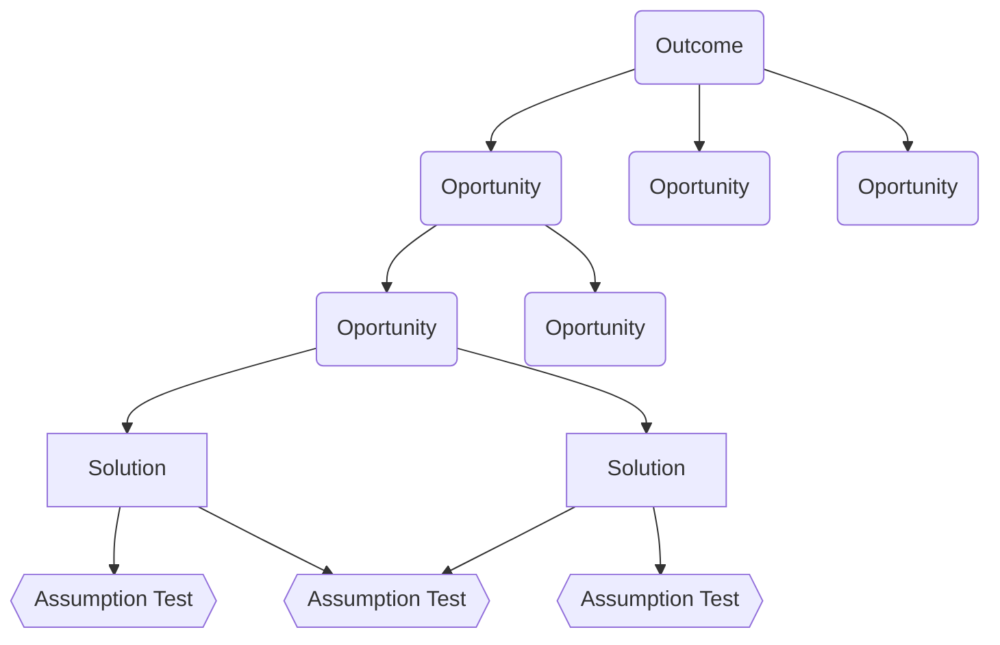
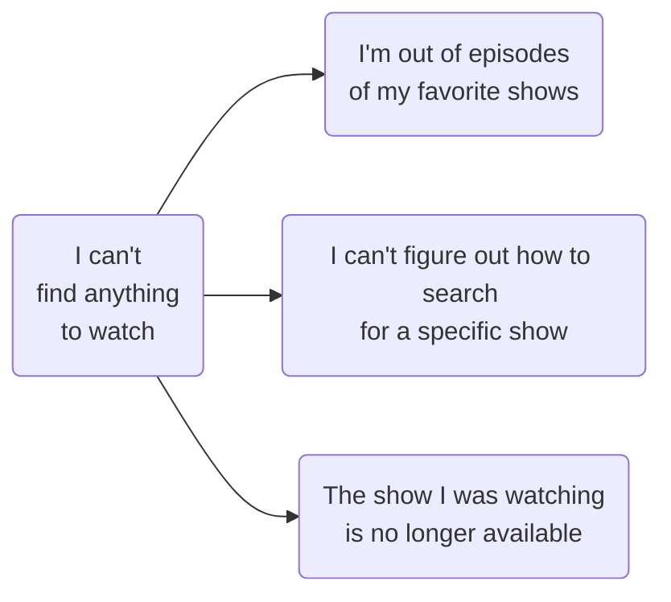

# árbol de oportunidad-solución
Propuesto por [[@torres2021]] como un modelo para implementar el [[descubrimiento continuo de producto]]. Estructura los conceptos básicos que ordenan la investigación constante. En abstracto:

Es trabajo del *Product Manager ordenar* las oportunidades descubiertas en una estructura coherente donde puedan relacionarse. [[@torres2021]] [cap. 6] da algunos ejemplos:

